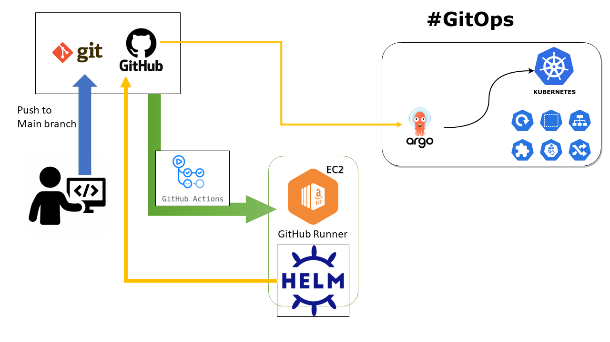
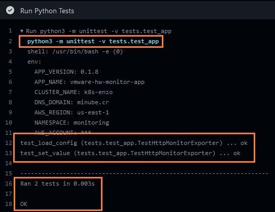
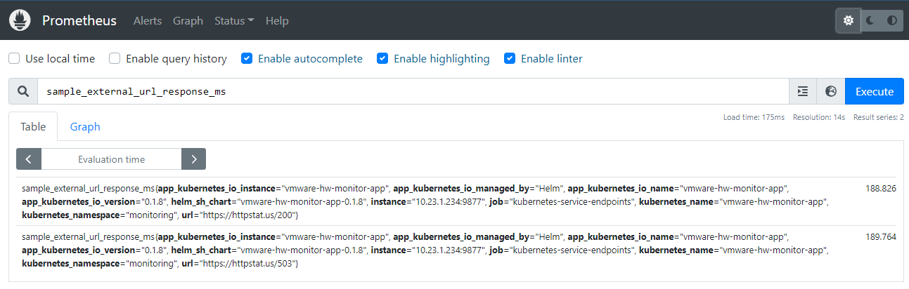
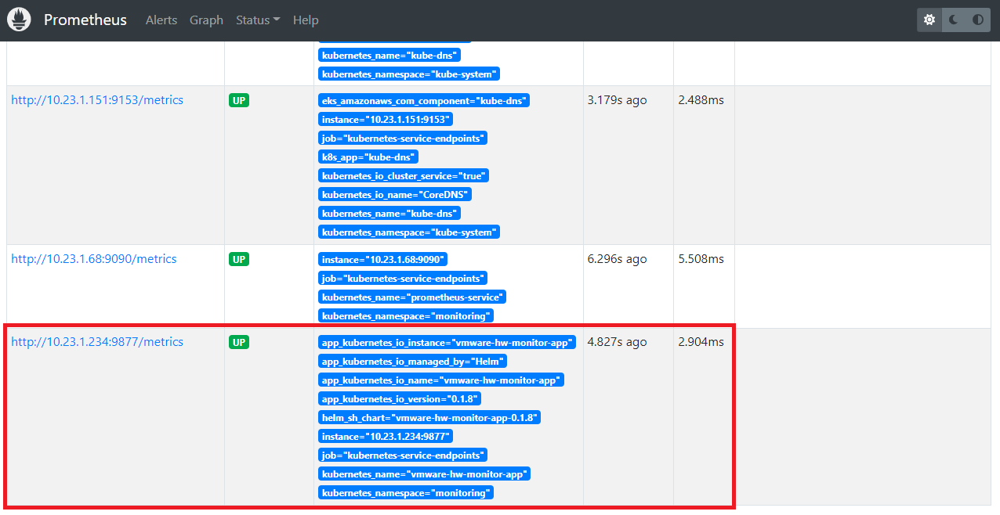
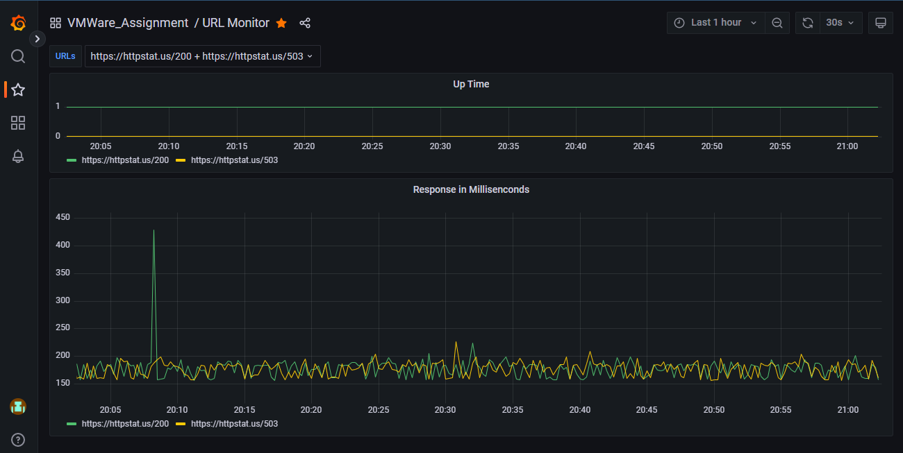
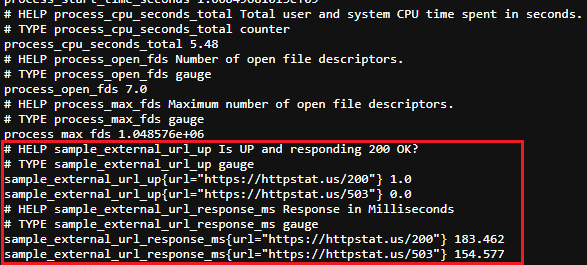

##### vmware-hw-monitor-app - repo
## VMWare's assignment for applying to Sr. SRE Roles
#### Author: Enzo Jimenez - enzofjh@gmail.com

[](https://github.com/enzojimenez/vmware-hw-monitor-app/actions/workflows/vmware-hw-monitor-app.yaml)

<hr>

## Code
* Programming language: _Python (v3.7.15)_
* Repository URL (this repo): _https://github.com/enzojimenez/vmware-hw-monitor-app_
* Branch: _main_
* Description: _1x Amazon EC2 instance was provisioned as a GitHub Runner agent with the following tools: Git, Terraform, Docker, AWS CLI, Kubectl, Helm, and Python 3._

## Dockerfile to build image
```Dockerfile
FROM python:3.7.15-bullseye
COPY app/ /opt/app/
WORKDIR /opt/app
RUN pip install -r requirements.txt
EXPOSE 9877
CMD ["python3", "main.py"]
```
* Build/Tag/Push commands:
  ```bash
  docker build -t enzojimenez/vmware-hw-monitor-app:0.1.0 .
  docker tag enzojimenez/vmware-hw-monitor-app:0.1.0 enzojimenez/vmware-hw-monitor-app:latest
  docker push enzojimenez/vmware-hw-monitor-app:0.1.0
  ```
* Pull command:
  ```bash
  docker pull enzojimenez/vmware-hw-monitor-app:latest
  ```
* Private Registry: _Amazon Elastic Container Registry (ECR)_
  * _Kubernetes cluster is currently pulling from here to secure the image in case of real scenario_
* Public Registry: _Docker Hub_
  * Repository: _https://hub.docker.com/r/enzojimenez/vmware-hw-monitor-app/tags_
* Note: THIS IS RUN AS PART OF A TRIGGERED PIPELINE

<hr>

## Kubernetes Deployment Specification / Image
* Cloud Provider: _Amazon Web Services_
* Technology: _Kubernetes Cluster (Amazon EKS)_
* K8s Deployment: _Helm Chart_
* Versioning Platform: _GitHub_
* Automation/Pipeline: _GitHub Actions_
  * Workflow: <a href="https://github.com/enzojimenez/vmware-hw-monitor-app/blob/main/.github/workflows/vmware-hw-monitor-app.yaml" target="_blank">.github/workflows/vmware-hw-monitor-app.yaml</a>
* GitOps: http://argo.k8s.azure.co.cr/applications
  * Argo App: <a href="https://github.com/enzojimenez/vmware-hw-monitor-app/blob/main/argocd/application.yaml" target="_blank">argocd/application.yaml</a>
* Diagram: 
* Note: THIS IS RUN AS PART OF A TRIGGERED PIPELINE

<hr>

## Unit Tests
* Unit Tests/Testing library: _unittest_
* Number of tests: 2 integration tests
* Run tests: 
  ```bash
  python3 -m unittest -v tests.test_app
  ```
* Note: THIS IS RUN AS PART OF A TRIGGERED PIPELINE
* Successful testing: 

<hr>

## Prometheus
* Live Demo: http://prometheus.k8s.azure.co.cr/graph
* Scraping technique: By using K8s annotations inside the service that will be auto-discovered by <b><kubernetes_sd_config></b> and then shown in "kubernetes-service-endpoints"
  * Helm chart definition (yaml): 
    ```yaml
     service:
     type: ClusterIP
     port: 80
     annotations:
       prometheus.io/port: '9877'
       prometheus.io/scrape: 'true'
    ```
  * Metric example + Labels: 
* Targets: http://prometheus.k8s.azure.co.cr/targets?search=#pool-kubernetes-service-endpoints
  * 
* Python Library: https://github.com/prometheus/client_python
* OPTIONAL: Exposed metrics -> 

<hr>

## Grafana - Dashboard
* Live Demo: http://grafana.k8s.azure.co.cr/d/Dip9SfD4z/url-monitor
  * Folder/Name: VMWare_Assignment / URL Monitor
  * User: _url_monitor_
  * Password: _url_monitor_
* File: <a href="https://github.com/enzojimenez/vmware-hw-monitor-app/blob/main/grafana/URL%20Monitor-1668109003975.json" target="_blank">grafana/URL-Monitor-1668109003975.json</a>
* Screenshot: 

<hr>

## How to install / Usage
* Pre-requisites:
  * Helm CLI installed
  * kubectl context set to a Kubernetes Cluster
  * Prometheus and Grafana installed
#### Steps:
1. Create a new namespace where all components will be created:
   > kubectl create namespace monitoring
2. Add Prometheus Community repo:
   > helm repo add prometheus-community https://prometheus-community.github.io/helm-charts
3. Install prometheus components under the newly added namespace monitoring:
   > helm install kube-prometheus-stack prometheus-community/kube-prometheus-stack --version 41.7.4 -n monitoring
4. Check the prometheus status by running:
   > kubectl --namespace monitoring get pods -l "release=kube-prometheus-stack"
5. When all pods are running, then clone the solution repo:
   > git clone https://github.com/enzojimenez/vmware-hw-monitor-app.git
6. Enter the repo folder:
   > cd vmware-hw-monitor-app
7. Now install the Python monitor-app in the namespace monitoring:
   > helm install monitoring-app vmware-hw-monitor-app -n monitoring
8. Check the monitor app's service:
   > kubectl describe service/monitoring-app-vmware-hw-monitor-app -n monitoring
9. Expose the service to the localhost from your machine:
   > kubectl port-forward service/monitoring-app-vmware-hw-monitor-app -n monitoring 9877:80
10. Navigate the URL locally in your computer:
    > http://localhost:9877/metrics
    > 